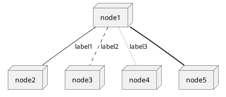

<!-- https://www.markdownguide.org/cheat-sheet/ -->

# Proyecto Plataforma Recogida de Paquetes InstaYA

NRC:**2118**
Equipo No. **06**

## Integrantes

• Angel Ernesto De Moya Mugno
• Daniela Alejandra Ospina Rubio
• Daritza Andrea Teherán Viñas
• Javier Mauricio Torres Vargas
• Jesús Antonio Vela Arango

<!-- ### Tutor -->

<!-- • Luis Sebastian Caicedo Pimienta -->

---

## Tabla de Contenido

- [Proyecto Plataforma Recogida de Paquetes InstaYA](#proyecto-plataforma-recogida-de-paquetes-instaya)
  - [Integrantes](#integrantes)
  - [Tabla de Contenido](#tabla-de-contenido)
  - [Enunciado](#enunciado)
    - [Notas](#notas)
  - [Descripción de roles del equipo](#descripción-de-roles-del-equipo)
  - [Diagrama de despliegue](#diagrama-de-despliegue)
  - [Definición de Artefactos - Product Backlog](#definición-de-artefactos---product-backlog)
    - [Método de Estimación Fibonacci](#método-de-estimación-fibonacci)
    - [Backlog Sprint #1](#backlog-sprint-1)
    - [Backlog Sprint #2](#backlog-sprint-2)
    - [Backlog Sprint #3](#backlog-sprint-3)
    - [Backlog Sprint #4](#backlog-sprint-4)
  - [Cronograma de Tareas](#cronograma-de-tareas)

---

## Enunciado

La empresa **InstaYA** requiere un sistema por medio del cual los usuarios puedan programar la recogida de paquetes para su futuro envío.

Los datos mínimos que requiere la empresa por parte del usuario para recoger el paquete son los siguientes:

• **Dia** y **franja horaria** en la cual se encuentra disponible el `usuario` para atender al personal encargado (Se debe programar con mínimo `24 horas de anticipación`).
• Las dimensiones `ancho x alto x largo`, si es `mercancía delicada o no` y el `peso aproximado`.
• `Dirección` del _lugar de recogida_, incluyendo `ciudad`.
• Número de `identificación personal` y `nombre completo` de _quien envía_.
• `Dirección` del _lugar hacia donde se realiza el envío_, incluyendo `ciudad`, así como el `número de identificación` personal y `nombre completo` de quien _recibe_.
Deben tener en cuenta las siguientes funcionalidades:
• Solo se maneja el `usuario cliente`, quien es el que realizará la _solicitud del servicio_.
• _Por cada envío_ se genera un `código único de seguimiento`.
• Un envío puede tener tres posibles estados: `Guardado` (al crearse), `Cancelado` o `Cumplido`
• **_Los envíos automáticamente se cumplen en 24 horas_**.

### Notas

• Los datos suministrados por los usuarios deben cumplir la política de **_privacidad de datos vigente_**, es decir las **contraseñas** de los usuarios deben almacenarse de forma cifrada y la **conexión al servidor** debe realizarse de forma segura.

> _Se entiende por información personal aquella suministrada por el usuario para el registro, la cual incluye datos como nombre, identificación, edad, género, dirección, correo electrónico y teléfono._[^1]

[^1]: https://www.mincit.gov.co/servicio-ciudadano/politicas-de-tratamiento-de-datos-personales

• La base de datos debe ser **no relacional**.
• Se debe utilizar una **arquitectura desacoplada**, es decir, una API back end y un front end que consuma dicha API.
• La API back end debe estar desarrollada en **Express.js**
• El front end debe estar desarrollado en **React.js**
• Se debe utilizar **Bootstrap** como librería CSS para manejar los estilos de su aplicación.


**Imagen 1** - Propuesta para wireframe del proyecto

- <strong>[Regresar](#tabla-de-contenido)</strong>

---

## Descripción de roles del equipo

<!-- TODO NOTA Este es el método para diseñar tablas en markdown, no es muy cosmética pero se podría trabajar externo y después se convierte a markdown -->

| Rol            | Integrante                        | Descripción                                                                                                                             | Tareas |
| -------------- | --------------------------------- | --------------------------------------------------------------------------------------------------------------------------------------- | ------ |
| Scrum Master   | Tutor<br>DanielaOR<br>DaritzaTV   | Encargados de gestionar y organizar el Scrum                                                                                            |        |
| Product Owner  | Tutor<br>JavierTV                 | Encargados de visionar & gestionar los objetivos a desarrollar en el proyecto además de mantener el product Backlog y gestionar el Team |        |
| UX Designer    | AngelDM                           | Encargado de generar y mantener una coherencia de la marca con el produco y de su experiencia con el usuario                            |        |
| UI Designer    | AngelDM<br>DanielaOR              | Encargados de diseñar los elementos visuales y de su interaccion con el usuario                                                         |        |
| Front-End Dev  | AngelDM<br>DanielaOR<br>DaritzaTV |                                                                                                                                         |        |
| Back-End Dev   | JavierTV<br>JesúsVA<br>DaritzaTV  |                                                                                                                                         |        |
| Full-Stack Dev | AngelDM<br>DaritzaTV<br>JesúsVA   |                                                                                                                                         |        |

**Tabla 1** - Descripción de Roles del Equipo

---

## Diagrama de despliegue

• Nombre Diagrama de despliegue #01

<!-- TODO ESTE ES UN EJEMPLO DE PLANTUML PERO NO FUNCIONA BIEN CON EL VISUALIZADOR MARKDOWN DE VSCODE. TOCA TRABAJARLO EXTERNO Y SE IMPORTA EL SVG o PNG-->



**Diagrama 1** - _Descripción_

<!-- TODO NOTA Este es un ejemplo de como se importa una imagen local-->


**Diagrama 2** - _Descripción_

- <strong>[Regresar](#tabla-de-contenido)</strong>

---

## Definición de Artefactos - Product Backlog

### Método de Estimación Fibonacci

| Calificación | Significado              | Descripción                                                                                                                                                                                                                                                                                           |
| ------------ | ------------------------ | ----------------------------------------------------------------------------------------------------------------------------------------------------------------------------------------------------------------------------------------------------------------------------------------------------- |
| 0            | **No requiere esfuerzo** | Requiere muy poco o ningún esfuerzo, pero no hay valor agregado para el negocio, entonces no acumula puntos para el trabajo.                                                                                                                                                                          |
| 1            | **Extrapequeño**         | Los desarrolladores sienten que entienden la mayoría de los requerimientos y los consideran relativamente fáciles, posiblemente el ítem más corto/pequeño del Sprint y realizable en un día.                                                                                                          |
| 2            | **Pequeño**              | Requiere de un poco de esfuerzo, y habilidades de resolución de problemas, pero los Desarrolladores ya han resuelto casos similares anteriormente, y sienten confianza con los requerimientos.                                                                                                        |
| 3            | **Promedio**             | Los Desarrolladores han resuelto muchas veces estos casos; saben lo que se necesita para culminar esta labor. Posiblemente se realicen unos pasos extra para resolverlo, y se logre el objetivo. Requiere muy poca o ninguna labor de investigación.                                                  |
| 5            | **Grande**               | Es un trabajo complejo, o los desarrolladores no realizan esta labor muy a menudo. La mayoría de los desarrolladores necesitarían asistencia de alguien más en el equipo. Es probablemente uno de los ítems más grandes por completar en un Sprint.                                                   |
| 8            | **Extragrande**          | Este tipo de ítems conlleva mucho tiempo e investigación y probablemente más de un desarrollador para completar dentro de un rango de dos semanas. Además, los desarrolladores necesitan hacer ciertas suposiciones que incrementan el riesgo y la culminación del ítem.                              |
| 13           | **¡Advertencia!**        | Es un trabajo muy complejo con mucha incertidumbre y requiere de múltiples suposiciones para dimensionar. Es mucho para completar en un Sprint. En cambio, se debería dividir en múltiples ítems que puedan ser completados de manera independiente.                                                  |
| 21           | **¡Riesgoso!**           | Un “21” o “34” refleja mucha complejidad para realizar en un sprint. Necesita más refinamiento. El gran tamaño indica mayor riesgo, suposiciones, y más dependencias involucradas para completar este tipo de ítems                                                                                   |
| ?            | **¡Peligro!**            | Como desarrollador, no queremos hacer este tipo de trabajo de la forma que se encuentra escrito. Presenta un alto grado de complejidad y no se puede completar en el marco de tiempo de un ciclo, iteración o Sprint. Tal vez los requerimientos son demasiado confusos que están plagados de peligro |

**Tabla 2** - Calificación por Método de Estimación Fibonacci [^2]

[^2]: Everet, J. (2021). _Practical Fibonacci: A Beginner's Guide to Relative Sizing_ [Tabla]. > Recuperado de https://www.scrum.org/resources/blog/practical-fibonacci-beginners-guide-relative-sizing

- <strong>[Regresar](#tabla-de-contenido)</strong>

---

### Backlog Sprint #1

| Id  | User Story                                                                                                                                                                                                                                            | Descripción                                                                                                                                                                                                                                                                                         | Estimación     | Responsable                                                                                             |
| --- | ----------------------------------------------------------------------------------------------------------------------------------------------------------------------------------------------------------------------------------------------------- | --------------------------------------------------------------------------------------------------------------------------------------------------------------------------------------------------------------------------------------------------------------------------------------------------- | -------------- | ------------------------------------------------------------------------------------------------------- |
| 01  | Cómo **cliente** quiero ingresar a la plataforma de InstaYA, **registrarme**, con mis **datos de contacto y personales**, para acceder a los servicios de la plataforma y posteriormente **agendar mi entrega**                                       | <ul><li>Vista Login<li>Vista Registro Nuevo Usuario<li>Vista Agendar Entrega</ul>                                                                                                                                                                                                                   | 5 **Grande**   | AngelDM<br>DanielaOR<br>DaritzaTV                                                                       |
| 02  | Cómo **cliente** quiero tener la posibilidad ver las horas de entrega disponibles para así poder seleccionar a mi conveniencia la que se ajuste a mis necesidades.                                                                                    | <ul><li>BD Pedidos</li><ul><li>Fechas</li></ul><li>Vista Agendar Entrega</li><ul><li>Fechas Disponibles</li></ul></ul>                                                                                                                                                                              | 3 **Promedio** | Full-Stack<ul><li>AngelDM<li>DaritzaTV<li>JesúsVA</ul> Back-End<ul><li>DaritzaTV<li>JavierTV<li>JesúsVA |
| 03  | Cómo **Aministrador de InstaYA** requiero que el **cliente** realize el agendamiento con **24 horas de anticipación** con el **Día** y la **hora** requerida para la entrega, además que aporte los **datos** necesarios para cumplir con la entrega. | <ul><li>BD Lista Órdenes<ul><li>Mercancía</li><ul><li>Dimensiónes</li><li>Delicada/No Delicado</li><li>Peso</li></ul></li><li>Solicitante</li><ul><li>Identificación</li><li>Nombre Completo</li></ul><li>Lugar de Envío</li><ul><li>Dirección de Envío</li><li>Ciudad</li></ul><li>Fecha</li></ul> | 5 **Grande**   | Back-End<ul><li>DaritzaTV<li>JavierTV<li>JesúsVA                                                        |
| 04  | Cómo **Administrador de InstaYA** necesito poder hacer **seguimiento** a los pedidos además de **verificar** y **actualizar** los datos y el **estado actual del envío** y para así asegurarme que los pedidos se estén entregando a las **24 horas** | <ul><li>BD Actualización & Registro Listado Ordenes</li><ul><li>Código de Seguimiento</li><li>Estado Envio</li><ul><li>Guardado</li><li>Cancelado</li><li>Cumplido                                                                                                                                  | 3 **Promedio** | Back-End<ul><li>DaritzaTV<li>JavierTV<li>JesúsVA                                                        |
| 05  |                                                                                                                                                                                                                                                       |                                                                                                                                                                                                                                                                                                     |                |

**Tabla 3** - Backlog - User Stories Sprint 1

### Backlog Sprint #2

| Id  | Descripción | Estimación | Responsable |
| --- | ----------- | ---------- | ----------- |
| 01  |             |            |             |
| 02  |             |            |             |
| 03  |             |            |             |
| 04  |             |            |             |
| 05  |             |            |             |

**Tabla 4** - Backlog - User Stories Sprint 2

### Backlog Sprint #3

| Id  | Descripción | Estimación | Responsable |
| --- | ----------- | ---------- | ----------- |
| 01  |             |            |             |
| 02  |             |            |             |
| 03  |             |            |             |
| 04  |             |            |             |
| 05  |             |            |             |

**Tabla 5** - Backlog - User Stories Sprint 3

### Backlog Sprint #4

| Id  | Descripción | Estimación | Responsable |
| --- | ----------- | ---------- | ----------- |
| 01  |             |            |             |
| 02  |             |            |             |
| 03  |             |            |             |
| 04  |             |            |             |
| 05  |             |            |             |

**Tabla 6** - Backlog - User Stories Sprint 4

- <strong>[Regresar](#tabla-de-contenido)</strong>

---

## Cronograma de Tareas

<!-- TODO NOTA Este diagrama de gann está realizado en plantuml pero se puede trabajar externo e importarlo en SVG ó PNG -->
<!-- https://plantuml.com/gantt-diagram -->

```puml
@startuml
header Plataforma Recogida de Paquetes - Grupo 2118_06
title Cronograma General del Proyecto
<style>
title{
	FontName JetBrains Mono
	FontStyle Bold
	FontSize 12
}
header {
	FontName JetBrains Mono
	FontStyle Light
	FontSize 10
}
ganttDiagram {
	timeline {
		FontName JetBrains Mono
		BackgroundColor LightGray

	}
	closed {
		BackgroundColor White
		FontColor Gray
	}
	FontName JetBrains Mono
	FontSize 10


	task {
		BackGroundColor GreenYellow
		LineColor DarkGreen
		unstarted {
			BackGroundColor OrangeRed
			LineColor FireBrick
		}

	}

	milestone {
			FontName JetBrains Mono
			FontColor FireBrick
			FontStyle bold
			FontSize 12
			BackgroundColor LightSalmon
			LineColor FireBrick
	}


}
</style>

' Color Fondo

2022-09-07 to 2022-09-13 are colored in LightGray
2022-09-14 to 2022-09-23 are colored in LightSteelBlue
2022-09-24 to 2022-10-05 are colored in LightGray
2022-10-06 to 2022-10-12 are colored in LightSteelBlue
' Nombre
2022-09-07 to 2022-09-13 are named [Sprint 1]
2022-09-14 to 2022-09-23 are named [Sprint 2]
2022-09-24 to 2022-10-05 are named [Sprint 3]
2022-10-06 to 2022-10-12 are named [Sprint 4]


language es
' Domingos y Feriados
sundays are closed and are colored White

' Domingo Entrega Sprint 1 Open
2022-07-17 is open

'Independencia
2022-07-20 is closed
2022-07-20 is colored in White
'Batalla Boyacá
2022-08-07 is closed
2022-08-07 is colored in White
'Virgen Maria
2022-08-15 is closed
2022-08-15 is colored in White
'Día de la Raza
'2022-10-17 is closed
'2022-10-17 is colored in White

'Día de los difuntos
'2022-11-07 is closed
'2022-11-07 is colored in White
'Independencia de Cartagena
'2022-11-14 is closed
'2022-11-14 is colored in White
'Día de la Inmaculada Concepción
'2022-12-08 is closed
'2022-12-08 is colored in White
'Navidad
'2022-12-25 is closed
'2022-12-25 is colored in White


2022-07-17 is colored in SteelBlue
2022-07-28 is colored in SteelBlue
2022-08-12 is colored in SteelBlue
2022-08-17 is colored in SteelBlue


Project starts 2022-09-07


--Sprint 1--
[Planificación\n& Diseño] starts 2022-09-07 and ends 2022-09-13
note bottom
<b>Roles</b>
** Definición
<b>Diagrama Despliegue</b>
** Descripción Componentes
*** Hardware
*** Software
*** Herramientas
<b>Artefactos</b>
** Backlog Producto
** Backlog Sprint
** Asignación Backlog->Rol
<b>Cronograma</b>
** Definición

end note

[Documento Descripcion Roles] starts 2022-09-07 and lasts 1 days
[Backlog Producto] starts 2022-09-07 and lasts 1 days
[Backlog por Sprint] Starts 2022-09-07 and lasts 1 days
[Asignacion Backlogs por Roles] starts 2022-09-07 and lasts 1 days
[Documento Clases Importantes] starts 2022-09-07 and lasts 2 days
[Definir Fechas Actividades] starts 2022-09-07 and lasts 1 days

[Proyecto - Status 1] starts 2022-09-07 and ends 2022-10-12
[Proyecto - Status 1] is 15% completed

[Entrega #1] happens 2022-09-13

--Sprint 2--
then [Front-End] starts 2022-09-14 and ends 2022-09-23


note bottom
<b>Mockups</b>
** Documento
** Mapa Navegabilidad
<b>React</b>
<b>Bootstrap</b>
** Selección
** Implementación
<b>GIT</b>
** Creacion Proyecto en GIT
end note
[Documento Mapa Navegabilidad] starts 2022-09-14 and lasts 3 days
[Diseño Vistas] starts 2022-09-14 and lasts 2 days
[Documento Vistas] starts 2022-09-14 and lasts 2 days
[Selección/Implementación\nEstilos Vistas] starts 2022-09-14 and lasts 2 days
[GIT] starts 2022-09-14 and lasts 3 days

[Proyecto - Status 2] starts 2022-09-07 and ends 2022-10-12
[Proyecto - Status 2] is 35% completed

[Entrega #2] happens 2022-09-23

--Sprint 3--
then [Forms & API] Starts 2022-09-24 and ends 2022-10-05
note bottom
<b>Componentes</b>
** Documento
** Esqueleto componentes
<b>Formularios</b>
** Formularios & Vinculos
*** Mapa Navegabilidad
** Renderizado
<b>Simulación API</b>
** Documento pruebas
    solicitudes API
end note
[Especificación Ruta] starts 2022-09-24 and lasts 2 days
[Definición HTTP] starts 2022-09-24 and lasts 1 days
[Lógica Algorítmica] starts 2022-09-24 and lasts 3 days
[Documento Controladores] starts 2022-09-24 and lasts 2 days
[Diagrama Relacional] starts 2022-09-24 and lasts 1 days
[Diseño BD MongoDB] starts 2022-09-24 and lasts 3 days
[Documento BD] starts 2022-09-24 and lasts 2 days
[Validación Datos Entrada] starts 2022-09-24 and lasts 2 days
[Prepared Statements] starts 2022-09-24 and lasts 2 days
[Queries Consultar/Actualizar BD] starts 2022-09-24 and lasts 2 days
[Documento Buenas Prácticas] starts 2022-09-24 and lasts 2 days
[Creación Sesiones] starts 2022-09-24 and lasts 4 days
[Funciones Hash para\nAlmacenar Contraseñas(salts)] starts 2022-09-24 and lasts 3 days

[Proyecto - Status 3] starts 2022-09-07 and ends 2022-10-12
[Proyecto - Status 3] is 80% completed

[Entrega #3] happens 2022-10-05

--Sprint 4--
then [Back & Deploy] Starts 2022-10-06 and ends 2022-10-12
note bottom
<b>Base de Datos</b>
    <b>No-Relacional</b>
<b>Node.js</b>
<b>Back-End</b>
<b>Conectividad BD</b>
<b>Despliegue Aplicación</b>
** Requerimientos
** Documentación
** Verificación
end note

[Requerimientos Despliegue] starts 2022-10-06 and lasts 3 days
[Documento Requerimientos &\nProceso Despliegue] starts 2022-10-06 and lasts 2 days
[Despliegue(por Definir)] starts 2022-10-06 and lasts 2 days
[Verificación Dominio\nhttps://mi_dominio] starts 2022-10-06 and lasts 2 days
[Verificación App] starts 2022-10-06 and lasts 3 days

[Proyecto - Status 4] starts 2022-09-07 and ends 2022-10-12
[Proyecto - Status 4] is 100% completed

[Entrega Final] happens at [Back & Deploy]'s end

[Planificación\n& Diseño] is colored in Fuchsia/FireBrick
[Front-End] is colored in LimeGreen/Green
[Forms & API] is colored in salmon/Red
[Back & Deploy] is colored in LightBlue/Blue
[Entrega Final] is colored in LightGreen/Green


@enduml

```

**Diagrama 1** - Diagrama Gantt - Cronograma/Rúbrica General del Proyecto

- <strong>[Regresar](#tabla-de-contenido)</strong>

---
